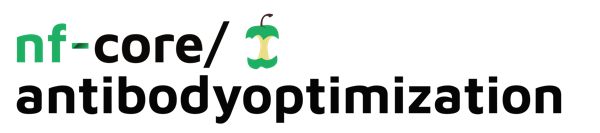

<h1>
  <picture>
    <source media="(prefers-color-scheme: dark)" srcset="docs/images/nf-core-antibodyoptimization_logo_dark.png">
    
  </picture>
</h1>

[](https://github.com/codespaces/new/nf-core/antibodyoptimization)
[](https://github.com/nf-core/antibodyoptimization/actions/workflows/nf-test.yml)
[](https://github.com/nf-core/antibodyoptimization/actions/workflows/linting.yml)[](https://nf-co.re/antibodyoptimization/results)[](https://doi.org/10.5281/zenodo.XXXXXXX)
[](https://www.nf-test.com)

[](https://www.nextflow.io/)
[](https://github.com/nf-core/tools/releases/tag/3.5.2)
[](https://docs.conda.io/en/latest/)
[](https://www.docker.com/)
[](https://sylabs.io/docs/)
[](https://cloud.seqera.io/launch?pipeline=https://github.com/nf-core/antibodyoptimization)

[](https://nfcore.slack.com/channels/antibodyoptimization)[](https://bsky.app/profile/nf-co.re)[](https://mstdn.science/@nf_core)[](https://www.youtube.com/c/nf-core)

## Introduction

**nf-core/antibodyoptimization** is a bioinformatics pipeline for end-to-end antibody optimization. It takes an antibody structure in PDB format as input and produces redesigned, structurally verified, and humanized antibody sequences with OASis humanness scores.

The pipeline runs four stages in sequence:

1. **[AntiFold](https://github.com/oxpig/AntiFold)** — CDR redesign via inverse folding, producing redesigned sequence candidates
2. **[BioPhi Sapiens](https://github.com/Merck/BioPhi)** — sequence humanization
3. **[ABodyBuilder2](https://github.com/oxpig/ImmuneBuilder)** — structure prediction for each humanized candidate
4. **[OASis](https://github.com/Merck/BioPhi)** — humanness scoring against observed antibody space

### Filtering

The pipeline applies quality filters between stages to reduce the candidate set before each computationally expensive step:

| Stage transition | Module | Metric | Description | Default threshold |
|---|---|---|---|---|
| AntiFold → BioPhi | `FILTER_ANTIFOLD` | `--antifold_min_score` | `score` field in AntiFold FASTA header: average log-odds across CDR positions; higher (less negative) = better sequence–structure fit | user-defined |
| BioPhi → ABodyBuilder2 | `FILTER_BIOPHI` | `--sapiens_min_score` | Mean Sapiens humanness score per sequence (0–1); filters poorly humanized candidates before structure prediction | `≥ 0.8` |
| ABodyBuilder2 → OASis | `FILTER_ABODYBUILDER2` | `--abodybuilder2_max_error` | Mean per-residue error estimate across CDR positions from ABodyBuilder2 B-factor column (Å, ensemble disagreement); lower = more confident prediction | `< 1.5` |
| ABodyBuilder2 → OASis | `FILTER_ABODYBUILDER2` | `--abodybuilder2_max_rmsd` | Cα RMSD of CDR regions between ABodyBuilder2-predicted structure and original input PDB (Å); ensures humanized sequence retains the parent fold | `< 2.0` |
| OASis → output | `RANK_OASIS` | `--oasis_min_percentile` | OASis percentile (0–100), calibrated against 544 therapeutic mAbs: human mAbs median ~80, humanized ~37, murine ~5; candidates are ranked by percentile and only extreme outliers excluded | `≥ 10` |

> [!NOTE]
> `--antifold_min_score` has no hardcoded default as the appropriate threshold is antibody-dependent. All other thresholds are suggested defaults and can be overridden at runtime.
>
> OASis percentile is used for **ranking**, not hard filtering. A minimum percentile of 10 excludes only extreme outliers (murine-like sequences). Do not use OASis score alone as an acceptance/rejection criterion — humanness does not directly predict clinical immunogenicity.

## Usage

> [!NOTE]
> If you are new to Nextflow and nf-core, please refer to [this page](https://nf-co.re/docs/usage/installation) on how to set-up Nextflow. Make sure to [test your setup](https://nf-co.re/docs/usage/introduction#how-to-run-a-pipeline) with `-profile test` before running the workflow on actual data.

First, prepare a samplesheet with your input data:

`samplesheet.csv`:

```csv
sample,pdb,chain_heavy,chain_light
Ab001,/path/to/Ab001.pdb,H,L
```

| Column | Description |
|---|---|
| `sample` | Unique sample identifier |
| `pdb` | Path to the antibody structure file (PDB format, IMGT-numbered) |
| `chain_heavy` | Chain ID of the heavy chain in the PDB file |
| `chain_light` | Chain ID of the light chain in the PDB file |

Now, you can run the pipeline using:

```bash
nextflow run nf-core/antibodyoptimization \
   -profile docker \
   --input samplesheet.csv \
   --outdir <OUTDIR>
```

> [!WARNING]
> Please provide pipeline parameters via the CLI or Nextflow `-params-file` option. Custom config files including those provided by the `-c` Nextflow option can be used to provide any configuration _**except for parameters**_; see [docs](https://nf-co.re/docs/usage/getting_started/configuration#custom-configuration-files).

For more details and further functionality, please refer to the [usage documentation](https://nf-co.re/antibodyoptimization/usage) and the [parameter documentation](https://nf-co.re/antibodyoptimization/parameters).

## Testing

A minimal test profile is provided that runs the pipeline against a pre-staged antibody structure ([6Y1L](https://www.rcsb.org/structure/6Y1L), IMGT-numbered).

**Stub run** (no containers required, validates workflow logic only):

```bash
nextflow run . -profile test,docker --outdir ./results -stub
```

**Full test run** (requires the test PDB to be available on the host at `/data/antifold/pdbs/6y1l_imgt.pdb`):

```bash
nextflow run . -profile test,docker --outdir ./results
```

The test samplesheet (`assets/samplesheet_test.csv`) uses chain IDs `H` (heavy) and `L` (light).

## Pipeline output

To see the results of an example test run with a full size dataset refer to the [results](https://nf-co.re/antibodyoptimization/results) tab on the nf-core website pipeline page.
For more details about the output files and reports, please refer to the
[output documentation](https://nf-co.re/antibodyoptimization/output).

## Credits

nf-core/antibodyoptimization was originally written by @darko-cucin @JelPej.

We thank the following people for their extensive assistance in the development of this pipeline:

<!-- TODO nf-core: If applicable, make list of people who have also contributed -->

## Contributions and Support

If you would like to contribute to this pipeline, please see the [contributing guidelines](.github/CONTRIBUTING.md).

For further information or help, don't hesitate to get in touch on the [Slack `#antibodyoptimization` channel](https://nfcore.slack.com/channels/antibodyoptimization) (you can join with [this invite](https://nf-co.re/join/slack)).

## Citations

<!-- TODO nf-core: Add citation for pipeline after first release. Uncomment lines below and update Zenodo doi and badge at the top of this file. -->
<!-- If you use nf-core/antibodyoptimization for your analysis, please cite it using the following doi: [10.5281/zenodo.XXXXXX](https://doi.org/10.5281/zenodo.XXXXXX) -->

<!-- TODO nf-core: Add bibliography of tools and data used in your pipeline -->

An extensive list of references for the tools used by the pipeline can be found in the [`CITATIONS.md`](CITATIONS.md) file.

You can cite the `nf-core` publication as follows:

> **The nf-core framework for community-curated bioinformatics pipelines.**
>
> Philip Ewels, Alexander Peltzer, Sven Fillinger, Harshil Patel, Johannes Alneberg, Andreas Wilm, Maxime Ulysse Garcia, Paolo Di Tommaso & Sven Nahnsen.
>
> _Nat Biotechnol._ 2020 Feb 13. doi: [10.1038/s41587-020-0439-x](https://dx.doi.org/10.1038/s41587-020-0439-x).
